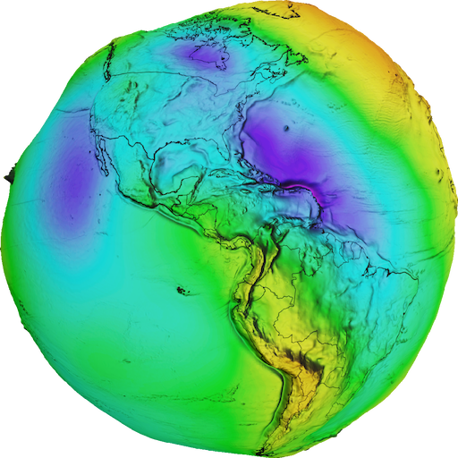
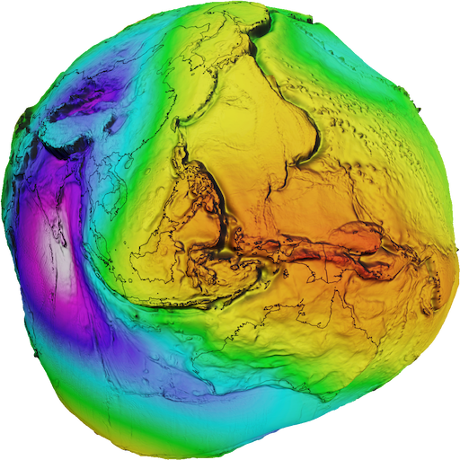
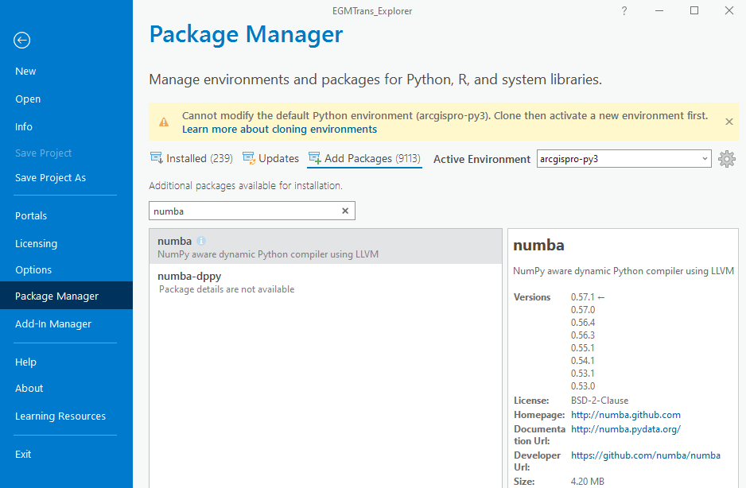
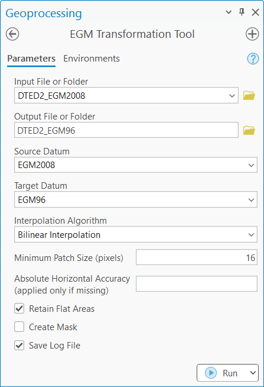
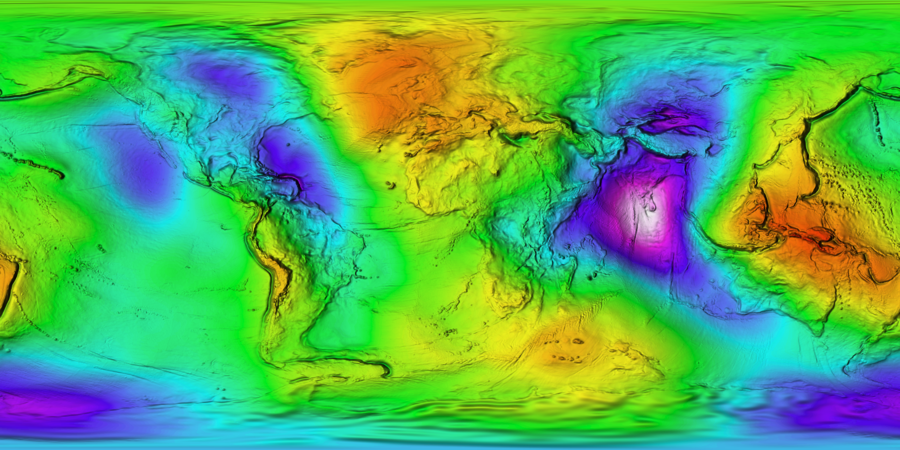
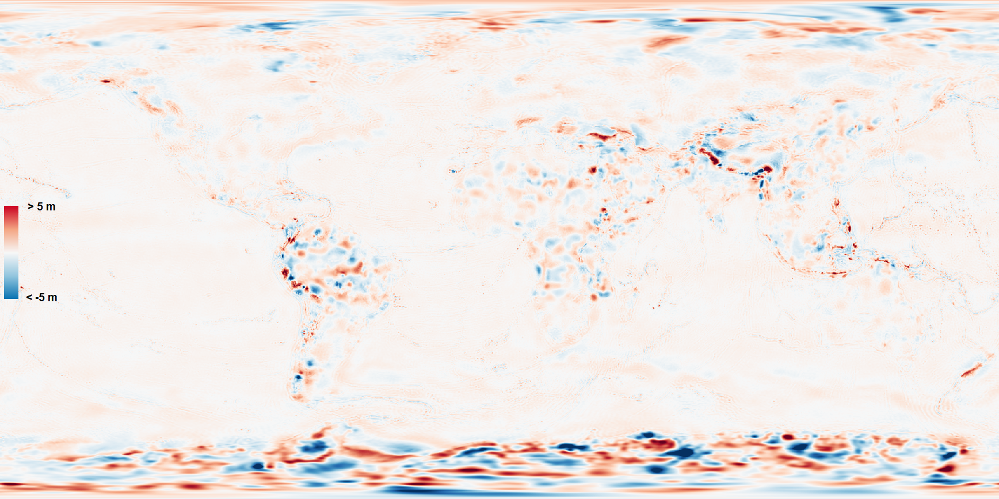
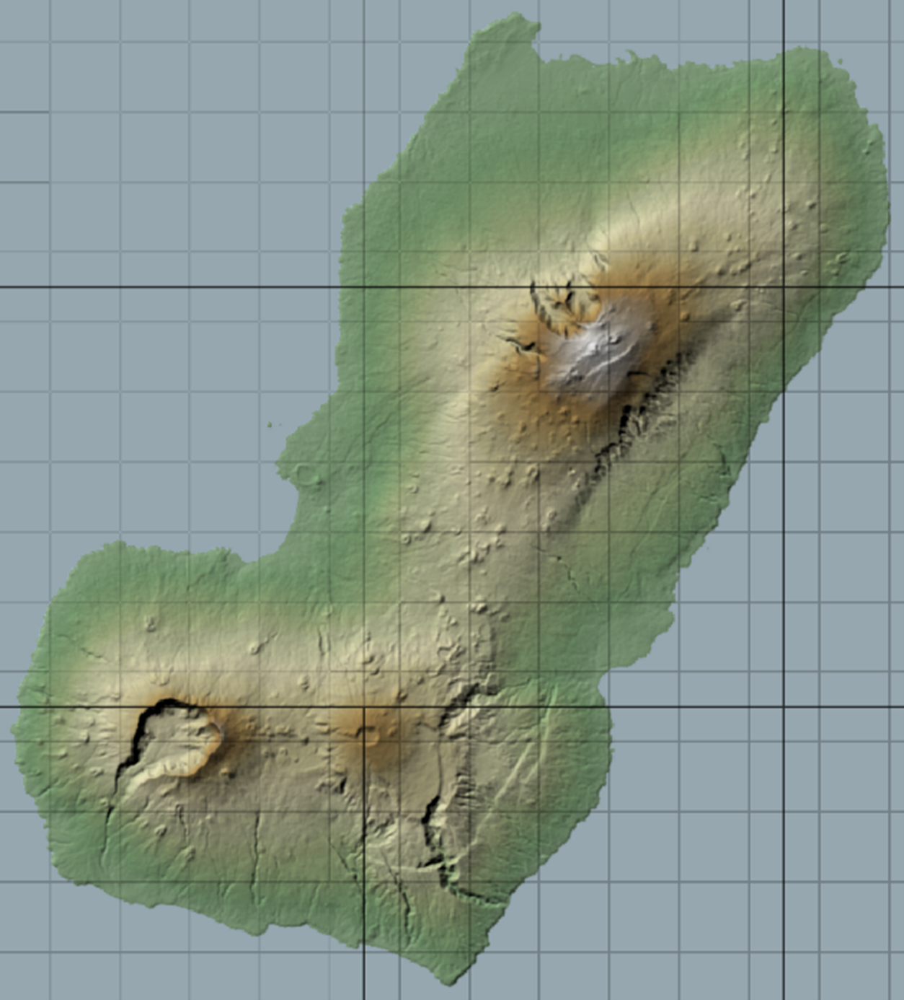
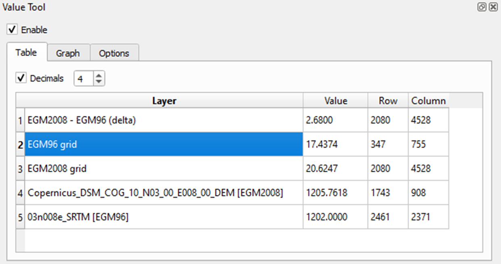

<div style="display: flex; justify-content: space-between; align-items: center">
      
      
   </div>

# EGMTrans Tool and Explorer

<p align="left">
  
  
</p>

EGMTrans transforms vertical datums between the WGS 84 ellipsoid and the EGM96 and EGM2008 geoids for DTED and GeoTIFF files. It resamples NGA's global geoid undulation models at one arc minute (~1.8 km) resolution to the input DEM resolution using bilinear, thin plate spline, or Delaunay triangulation interpolation, then applies the difference to generate the output DEM. It can be run as an ArcGIS Pro toolbox or a standalone Python script.

The companion **EGMTrans Explorer** map, available for both ArcGIS Pro and QGIS, stores the full-resolution geoid models and allows users to interrogate datum transformations performed by this tool or other software and identify datum errors.

## Table of Contents

- [Features](#features)
- [Versioning](#versioning)
- [License](#license)
- [Prerequisites](#prerequisites)
- [Installation](#installation)
- [Performance Considerations](#performance-considerations)
- [Geoid Grid Files](#geoid-grid-files)
- [ArcGIS Pro Setup Instructions](#arcgis-pro-setup-instructions)
- [ArcGIS Pro Python Environment](#arcgis-pro-python-environment)
- [Using the Transformation Tool in ArcGIS Pro](#using-the-transformation-tool-in-arcgis-pro)
- [Using EGMTrans on the Command Line](#using-egmtrans-on-the-command-line)
- [EGMTrans Explorer](#egmtrans-explorer)
- [Interpolation Algorithms](#interpolation-algorithms)
- [DTED Header Handling](#dted-header-handling)
- [Notes](#notes)
- [Constraints](#constraints)
- [Troubleshooting](#troubleshooting-the-egmtrans-toolbox-in-arcgis-pro)
- [Contact](#contact)

## Features

- Performs transformations between WGS84, EGM96, and EGM2008 vertical datums
- Handles both DTED (Digital Terrain Elevation Data) and GeoTIFF file formats
- Processes either individual files or entire directories
- Applies scale factors and offsets automatically when needed
- Outputs Cloud Optimized GeoTIFF (COG) format for non-DTED results
- Preserves ocean and flat areas during transformation with customizable patch size
- Creates optional mask files of ocean and other flat regions for further analysis
- Utilizes parallel processing for improved performance on multi-core systems
- Supports multiple interpolation algorithms (bilinear, thin plate spline, and Delaunay triangulation)
- Supports NGA's most widely used coordinate reference systems, including geographic, UTM and polar stereographic projections
- The EGMTrans Explorer in ArcGIS and QGIS formats permits visualization and comparison of the geoids with each other and elevation datasets

## Versioning

This project adheres to [Semantic Versioning](https://semver.org/spec/v2.0.0.html). The current version is `1.1.0`.

The version is defined in [`src/egmtrans/_version.py`](src/egmtrans/_version.py) as the single source of truth.

For a detailed list of changes for each version, please see the [`CHANGELOG.md`](CHANGELOG.md) file.

## License

This project is licensed under the MIT License - see the [`LICENSE`](LICENSE) file for details.

## Prerequisites

- Python 3.11+
- GDAL 3.11.0+ (with Python bindings)
- NumPy 1.22.0+
- SciPy 1.7.0+
- Numba 0.60+ (recommended but optional)

## Installation

### Option A: Install as a Python package (recommended)

```bash
pip install -e .               # includes numba + tqdm for best performance
pip install -e ".[core]"       # without numba/tqdm (restricted environments)
pip install -e ".[dev]"        # with test/lint tools
```

After installation, download the required geoid grid files:

```bash
python download_grids.py
```

Then the `egmtrans` command is available:

```bash
egmtrans -i input.tif -o output.tif -s WGS84 -t EGM2008
```

### Option B: Run directly (no install)

```bash
python download_grids.py
python EGMTrans.py -i input.tif -o output.tif -s WGS84 -t EGM2008
```

The root-level `EGMTrans.py` is a backward-compatibility shim that re-exports from the `egmtrans` package.

### Option C: Conda environment

```bash
conda env create -f environment.yml
conda activate egm_trans
pip install -e .
python download_grids.py
```

Note: GDAL installation can be complex. Consider using Anaconda for a smoother installation process.

## Performance Considerations

### Numba Acceleration

Numba is a Just-In-Time (JIT) compiler that significantly accelerates computational operations in EGMTrans:

- **Performance Boost**: Numba can accelerate processing by 20-50x depending on the dataset size and operation
- **Parallel Processing**: Enables efficient multi-core utilization for large datasets
- **Memory Efficiency**: Optimized memory usage for processing large DEMs

While Numba is recommended for optimal performance, EGMTrans will function without it in environments where installation is restricted.

- **Graceful Degradation**: The tool automatically detects if Numba is available and falls back to non-accelerated implementations if necessary.
- **Processing Time**: Without Numba, expect significantly longer processing times, especially for large datasets or batch operations.
- **Memory Usage**: Non-accelerated processing may require more memory for equivalent operations.

For restricted environments without access to Anaconda or custom ArcGIS Pro environments, EGMTrans will still work, but processing will be slower. For this reason, numba installation is recommended for large batch transformations.

## Geoid Grid Files

The geoid grid GeoTIFFs (~1.3 GB total) are hosted as [GitHub Release assets](https://github.com/ngageoint/EGMTrans/releases/tag/datum-grids-v1), not stored in the repository itself. Download them by running:

```bash
python download_grids.py
```

The ArcGIS Pro toolbox downloads the grid files automatically on first run -- no terminal required.

The required files for transformation are:
- EGM96: `us_nga_egm96_1.tif`
- EGM2008: `us_nga_egm08_1.tif`

These are the one-arc-minute geoid models in Cloud Optimized GeoTIFF (COG) format prepared by the U.S. National Geospatial-Intelligence Agency (<https://earth-info.nga.mil/>).

Three additional grids are downloaded for the EGMTrans Explorer map: the EGM96-to-EGM2008 difference grid, and lower-resolution versions of EGM2008 (2.5 arc minutes) and EGM96 (15 arc minutes). The lower-resolution grids can also be obtained from the PROJ.org CDN: <https://cdn.proj.org/>. However, NGA does not recommend using them for transformation. Errors of >0.5 m have been observed between the sparse 15 arc minute (~27 km) EGM96 posts, where it becomes decoupled from the denser 2.5 arc minute (~4.5 km) EGM2008 posts. In contrast, the 1 arc minute grids have a post spacing of ~1.8 km.

| Grid | Resolution | Post Spacing |
|------|-----------|--------------|
| EGM96 (15') | 15 arc minutes | ~27 km |
| EGM2008 (2.5') | 2.5 arc minutes | ~4.5 km |
| **EGM96 / EGM2008 (1')** | **1 arc minute** | **~1.8 km** |

Note that the PROJ engine relies on the lower-resolution versions, so the `proj` interpolation option is not recommended. These grids are included for reference only.

## ArcGIS Pro Setup Instructions

1. Ensure you have ArcGIS Pro installed on your system.

2. Copy the `EGMTrans` folder to a location accessible by ArcGIS Pro.

3. Make sure the `EGMTrans.py` file and `src/` directory are located in the `EGMTrans` directory. The directory structure should look like this:

```
EGMTrans/
├── src/
│   └── egmtrans/           # Python package (core logic)
│       ├── __init__.py
│       ├── _version.py
│       ├── _state.py
│       ├── config.py
│       ├── cli.py
│       ├── crs.py
│       ├── interpolation.py
│       ├── flattening.py
│       ├── io.py
│       ├── transform.py
│       ├── file_utils.py
│       ├── arcpy_compat.py
│       ├── logging_setup.py
│       └── numba_utils.py
├── tests/                   # Test suite
├── arcgis/                  # ArcGIS Pro toolbox
│   ├── EGMTransToolbox.pyt
│   ├── execution.py
│   └── ...
├── crs/                     # PROJ data
├── datums/                  # Geoid grids (downloaded separately)
├── samples/                 # Sample elevation data
├── img/
├── EGMTrans.py              # Backward-compat shim
├── pyproject.toml
├── environment.yml
├── CHANGELOG.md
├── LICENSE
└── README.md
```

4. Geoid grid files will be downloaded automatically the first time you run the EGMTrans Tool. Alternatively, run `python download_grids.py` from the EGMTrans directory, or download the grid files manually from the [GitHub Releases page](https://github.com/ngageoint/EGMTrans/releases/tag/datum-grids-v1) and place them in the `datums/` folder.

5. Open ArcGIS Pro and create a new project or open an existing one.

6. In the Catalog pane, right-click on Toolboxes and select "Add Toolbox".

7. Navigate to the `EGMTrans/arcgis` folder and select the `EGMTransToolbox.pyt` file.

8. The "EGMTransToolbox" toolbox should now appear in your Toolboxes list.

## ArcGIS Pro Python Environment

**ArcGIS Pro Package Manager**  


In order to run the *EGM Transformation Tool* in ArcGIS Pro with optimal performance, the Python active environment should include the `numba` package. Numba is an optimizing compiler that uses parallelization to increase the speed of water flattening and masking operations by 20 to 50 times. It is not installed in the default Python environment (`arcgispro-py3`). To use it, follow these steps:

1. Clone the default environment into a new environment (e.g. `arcgispro-egm`). This may take some time. If the clone fails, you may need to work with your IT department. If you already have a cloned environment (not `arcgispro-py3`) you may use that.

2. Make the cloned environment active, then click on the `Add Packages` tab.

3. Search for "numba" and install it.

4. Ensure that the same environment is active when the Transformation Tool is run.

Note: While Numba is recommended for optimal performance, EGMTrans will still function without it, though processing will be _significantly_ slower.

**EGMTrans Tool in ArcGIS Pro**  


## Using the Transformation Tool in ArcGIS Pro

1. In the Catalog pane, expand the *EGMTransToolbox.pyt* toolbox.

2. Double-click on the *EGM Transformation Tool* tool to open it.

3. Fill in the required parameters:
   - **Input File or Folder**: Select your input DTED or GeoTIFF file, or a folder containing multiple files.
   - **Output File or Folder**: Specify the output location for the transformed file(s).
   - **Source Datum**: Select the source vertical datum (EGM2008, EGM96, or WGS84).
   - **Target Datum**: Select the target vertical datum (EGM2008, EGM96, or WGS84).

4. (Optional) Adjust the additional parameters if desired:
   - **Interpolation Algorithm**: Choose the interpolation method (Bilinear Interpolation, Thin Plate Spline, Delaunay Triangulation); defaults to Bilinear Interpolation.
   - **Minimum Patch Size**: Specify the minimum size (in pixels) for flat areas to be retained; defaults to 16.
   - **Absolute Horizontal Accuracy**: Provide a default horizontal accuracy that will be added to the output DTED file if it is missing from the input.
   - **Retain Flat Areas**: Check this box to preserve flat areas and keep ocean at 0 during transformation; checked by default.
   - **Create Mask**: Check this box to create a mask of ocean and other flat areas; unchecked by default.
   - **Save Log File**: Check this box to save the log messages to an external .log file in the output directory.

5. Click "Run" to execute the tool.

6. The tool will process the input file(s) and create the transformed output(s) in the specified location.

## Using EGMTrans on the Command Line

The basic syntax for using EGMTrans in a terminal or command prompt is:

```
python EGMTrans.py -i INPUT -o OUTPUT -s SOURCE_DATUM -t TARGET_DATUM \
  [-f FLATTEN] [-m CREATE_MASK] [-p MIN_PATCH_SIZE] [-a ALGORITHM]
```

Arguments:
- `-i`, `--input`: Path to input file or directory
- `-o`, `--output`: Path for output file or directory
- `-s`, `--source_datum`: Source vertical datum (EGM2008, EGM96, or WGS84)
- `-t`, `--target_datum`: Target vertical datum (EGM2008, EGM96, or WGS84)
- `-f`, `--flatten`: Whether to retain flat areas (optional; default: True)
- `-m`, `--create_mask`: Whether to create a flat mask file (optional, default: False)
- `-p`, `--min_patch_size`: Minimum size in pixels for a flat area to be retained (optional; default: 16)
- `-a`, `--algorithm`: Interpolation algorithm to use (optional; choices: 'bilinear', 'spline', 'delaunay', 'proj'; default: 'bilinear')
- `-h`, `--abs_horiz_accuracy`: A default horizontal accuracy that will be added to the output DTED file only if it is missing from the input.
- `-l`, `--log_file`: Whether to save the log messages to an external .log file in the output directory.

### Examples

The files referenced in the following cases are stored in the `samples/` directory.

1. Transform a Copernicus DEM from EGM2008 to EGM96, retaining flat areas:

```bash
python EGMTrans.py -i "samples/Copernicus_DSM_COG_10_N06_00_E126_00_DEM.tif" \
  -o "samples/Copernicus_DSM_COG_10_N06_00_E126_00_DEM_EGM96.tif" \
  -s EGM2008 -t EGM96 -f True -p 25
```

2. Transform an SRTM DTED file from EGM96 to EGM2008, while simultaneously creating an ocean mask file:

```bash
python EGMTrans.py -i "samples/03n008e_SRTM.dt2" \
  -o "samples/03n008e_SRTM_EGM2008.dt2" \
  -s EGM96 -t EGM2008 -f True -m True
```

3. Transform a 1.5m LiDAR-derived DSM over Mazatlán, Mexico from EGM2008 to WGS84 ellipsoid, without flattening:

```bash
python EGMTrans.py -i "INEGI_Mexico_150cm_f13a35e4_DSM.tif" \
  -o "INEGI_Mexico_150cm_f13a35e4_DSM_WGS84.tif" \
  -s EGM2008 -t WGS84 -f False
```

4. Batch process a directory of TERRAFORM (DTED2 format) files and transform them all to EGM2008:

```bash
python EGMTrans.py -i "TERRAFORM_EGM96" -o "TERRAFORM_EGM2008" -s EGM96 -t EGM2008
```

5. Transform a Copernicus DEM using spline interpolation for highest accuracy (slower):

```bash
python EGMTrans.py -i "samples/Copernicus_DSM_COG_10_N06_00_E126_00_DEM.tif" \
  -o "samples/Copernicus_DSM_COG_10_N06_00_E126_00_DEM_EGM96.tif" \
  -s EGM2008 -t EGM96 -a spline
```

## EGMTrans Explorer

**EGM2008 shaded relief**  


The EGMTrans Explorer is provided in two software formats: ArcGIS Pro (.aprx) and QGIS (.qgz). Both versions provide a user-friendly interface for visualizing and analyzing the results of datum transformations.

It renders the EGM2008 and EGM96 Cloud Optimized GeoTIFFs (COGs) as both (1) grids and (2) color relief files. Using the datum "grids" allows the user to visualize the relative horizontal resolution of the 1-arc-minute grids and the standard EGM products, which are 15 arc minutes for EGM96 and 2.5 arc minutes for EGM2008. When zooming out, a hillshade, combined with the color relief map, functions as shaded relief to add depth to the geoid models. There is also a 1-arc-minute delta grid, created by subtracting the EGM96 geoid undulation from the EGM2008 geoid undulation, allowing the datums to be compared with each other and with any DEMs that a user loads into the map. An Open Street Map (OSM) basemap layer provides additional geospatial context.

The EGMTrans Explorer offers the following capabilities:

- Interactive map display of EGM96 and EGM2008 geoid undulations
- Difference calculation and visualization between EGM96 and EGM2008 geoids
- Comparison of original and transformed DEMs
- Comparison of DEMs and point clouds against reference elevation (e.g. TanDEM-X) to identify datum errors

**EGM96 to EGM2008 delta**  


**EGM96 15' (black) and EGM2008 2.5' (gray) grids**  


## Using the EGMTrans Explorer

1. Open the `EGMTrans_Explorer` file in ArcGIS Pro (`.aprx`) or QGIS (`.qgz`).

2. Use the provided map layers to visualize the EGM96 and EGM2008 geoids.

3. Load your elevation datasets (DEMs and point clouds) into the Explorer to compare them with the geoid heights.

4. Utilize the analysis tools in the Explorer to compare datums, calculate differences, and generate statistics.

5. Customize the symbology and labeling as needed for your specific analysis requirements.

6. Export your visualizations and analysis results using the standard ArcGIS Pro or QGIS export tools.

7. In QGIS, the "Value Tool" plugin (https://plugins.qgis.org/plugins/valuetool/) can be used to instantly query the value of all rasters turned on in the map (see below).

**QGIS Value Tool plugin**  


## Interpolation Algorithms

EGMTrans supports multiple interpolation algorithms for vertical datum transformation:

- **bilinear** (default): Fast and memory-efficient interpolation suitable for most applications. Provides a good balance between speed and accuracy.
- **spline**: Uses thin plate spline interpolation for highest accuracy, especially in areas with complex geoid variations. Significantly slower than other methods.
- **delaunay**: Uses triangulation-based linear interpolation. More accurate than bilinear for irregular point distributions (not an issue with datum grids) but slower.
- **proj**: Uses GDAL's built-in vertical datum transformation capabilities. Fastest option but may produce artifacts at edges. Not available in ArcGIS Pro.

The choice of algorithm depends on your specific requirements:
- For most applications, the default **bilinear** algorithm provides the best balance of speed and accuracy
- For highest accuracy, especially in areas with complex geoid variations, use **spline**

## DTED Header Handling

When transforming DTED files, EGMTrans updates the output file's header to reflect the new vertical datum. This process adheres to [**STANAG 3809**](https://nsgreg.nga.mil/doc/view?i=2126) for the header metadata. Note, however, that STANAG 3809 (MIL-PRF-89020B) was last updated in 2004 and does not support EGM2008 for standard DTED products. While GeoTIFF transforms can go in any direction, DTED transforms should only use EGM96 as the target datum for full standard compliance.

The tool performs the following updates:
- **Vertical Datum:** The vertical datum code is updated to `E96` for EGM96.
- **Accuracy Fields:** The tool checks the absolute and relative horizontal and vertical accuracy fields. If any of these fields contain non-numeric values (e.g., `NA  `), they are standardized to `  NA` (right-aligned) to ensure compliance with the specification. This helps to prevent issues with software that may not correctly handle non-standard accuracy values.
- **Horizontal Accuracy Default**: If the absolute horizontal accuracy of the input DTED file is missing, and a default value is provided in the parameters, it will be inserted into the output header. This can prevent errors in some software programs, which expect the value to be populated.

## Notes

- When processing DTED files, the output must also be in DTED format.
- DTED files can only use EGM96 or EGM2008 as vertical datums, not WGS84.
- The flattening option is not available when transforming to or from WGS84.
- The interpolation algorithms use Python's NumPy and Numba modules, not Esri's Spatial Analyst license.
- For GeoTIFF outputs, the tool creates Cloud Optimized GeoTIFFs (COGs) with DEFLATE compression.
- The tool rounds elevation values to the nearest centimeter to reduce noise in flat area detection and improve compression.
- When batch processing, the tool preserves the input directory structure and auxiliary files in the output directory.
- The minimum patch size parameter can be adjusted to control the granularity of flat area preservation.
- Creating mask files can be useful for quality control and understanding the distribution of flat areas.
- The script creates a detailed log file ending in `_transform.log` in the output directory.
- Performance is significantly improved (by 20-50x) when Numba is available, especially for large datasets.

## Constraints

The following operations are not allowed and will cause the transformation to abort.
- Transforming DEMs in unsupported formats (only GeoTIFF, DTED0, DTED1, and DTED2 are supported).
- Transforming DTED files to the WGS 84 ellipsoid, which is outside the DTED specification (STANAG 3809).
- Transforming files with a horizontal datum other than WGS 84 (e.g., NAD83).
- Creating DTED files from GeoTIFFs, which lack the necessary header metadata.
- Transforming GeoTIFFs with more than one band. If multi-band GeoTIFFs (e.g. auxiliary orthophotos) exist in directories during batch processing, they will be ignored.

In addition, users will be warned in the following circumstances and asked if they wish to proceed:
- The user requests flattening or ignores the flag (flattening is the default), when transforming to or from the WGS 84 ellipsoid. Flattening can only be applied between orthometric heights. If the user chooses to proceed with the transformation, no flattening will occur.
- The source datum and target datum are the same. If the source is a GeoTIFF file and the user chooses to proceed, the output GeoTIFF will be assigned the correct vertical datum (which is often missing in GeoTIFF files) with values rounded to 1 cm and optimized DEFLATE compression. If the source is a DTED file, the operation will abort.
- The source datum does not match the datum in the source file header. If the user chooses to proceed, the source file metadata will be ignored. This may be necessary if the source file is in error, but it is important to check the sources to be sure.

## Troubleshooting the EGMTrans Toolbox in ArcGIS Pro

- If you encounter any issues with the toolbox, check the ArcGIS Pro Python window for error messages.
- Ensure that the `EGMTrans.py` file is correctly located in the `EGMTrans` directory.
- Make sure you have the necessary permissions to read the input files and write to the output location.
- For Explorer-specific issues, ensure that your transformed files are in the correct location and properly referenced in the ArcGIS Pro project.
- If you encounter performance issues, check if Numba is installed and properly configured in your Python environment.

## Additional Resources

- For more information on vertical datums and their transformations, contact NGA's [Office of Geomatics](https://earth-info.nga.mil/).
- To learn more about using Python toolboxes in ArcGIS Pro, consult the [ArcGIS Pro documentation](https://pro.arcgis.com/en/pro-app/latest/arcpy/geoprocessing_and_python/a-quick-tour-of-python-toolboxes.htm).

For further assistance, please contact the tool developer (see below) or refer to the ArcGIS Pro documentation on using Python toolboxes and working with elevation data.

## Contact

If you have questions about this program or would like to know more about NGA's geodetic and elevation products, please contact us!  

**National Geospatial-Intelligence Agency (NGA)**  
_Office of Geomatics & Targeting, Elevation Division_  
3838 Vogel Road  
Mail Stop L-041  
Arnold, MO 63010  
+1 314-676-9146  
<terrain@nga.mil>