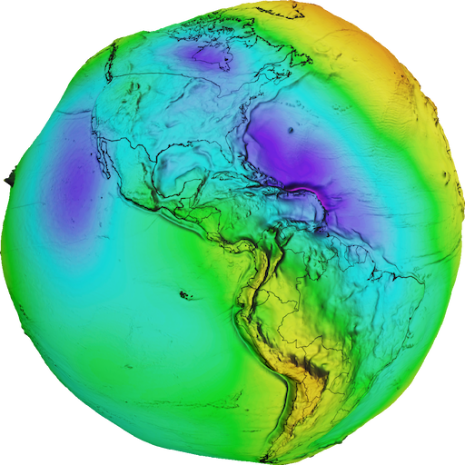
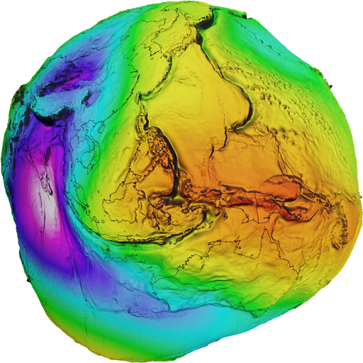
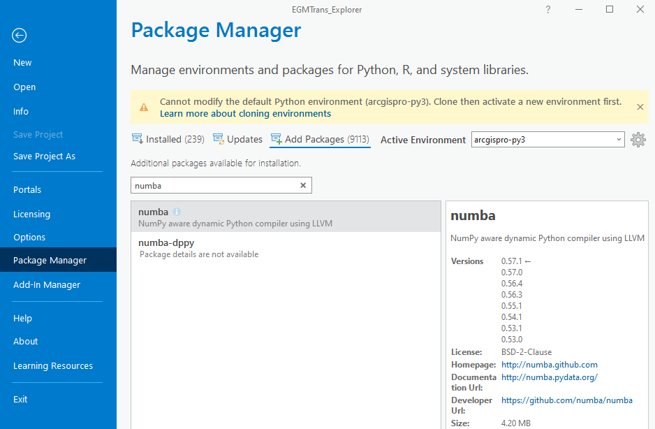
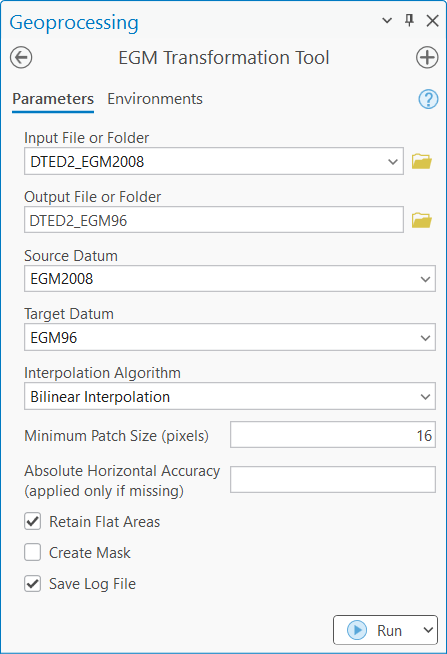
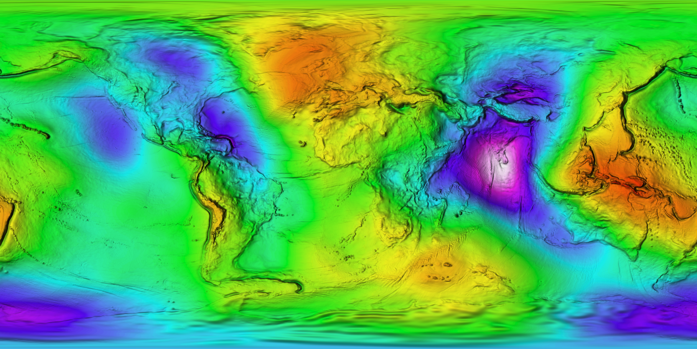
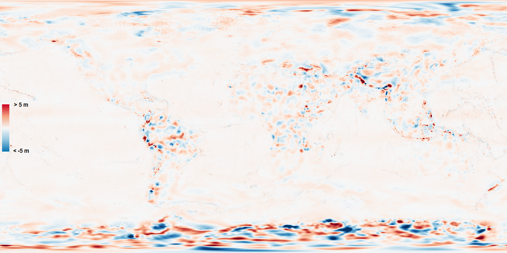
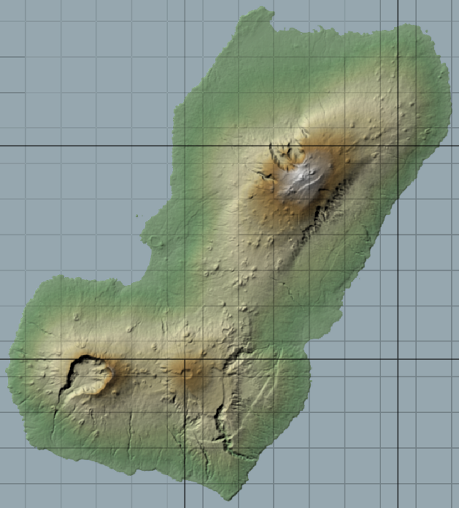
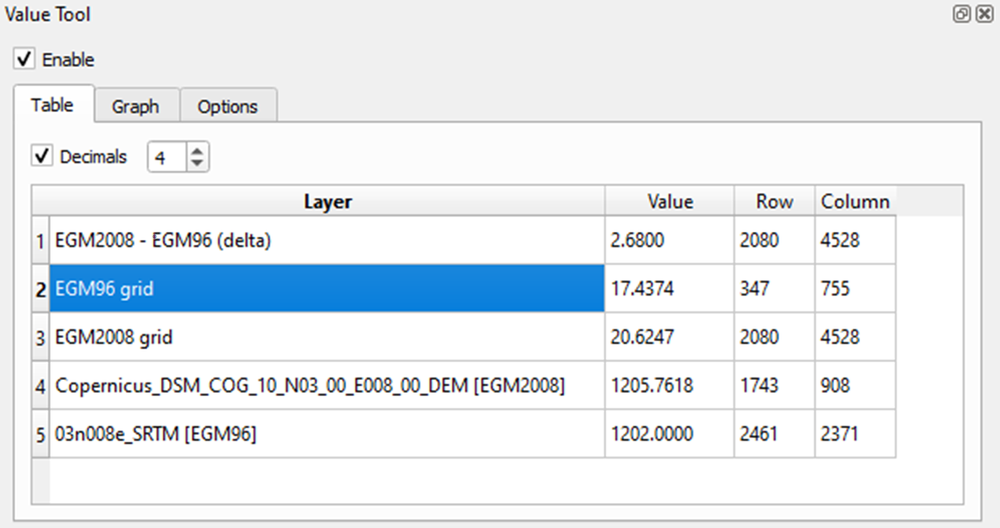

<div style="display: flex; justify-content: space-between; align-items: center">
      
      
   </div>

# EGMTrans Tool and Explorer

<p align="left">
  
  
</p>

EGMTrans transforms vertical datums between the WGS 84 ellipsoid and the EGM96 and EGM2008 geoids for DTED and GeoTIFF files. It resamples NGA's global geoid undulation models at one arc minute (~1.8 km) resolution to the input DEM resolution using bilinear, thin plate spline, or Delaunay triangulation interpolation, then applies the difference to generate the output DEM. It can be run as an ArcGIS Pro toolbox or a standalone Python script.

The companion **EGMTrans Explorer** map, available for both ArcGIS Pro and QGIS, stores the full-resolution geoid models and allows users to interrogate datum transformations performed by this tool or other software and identify datum errors.

## Table of Contents

- [Features](#features)
- [Versioning](#versioning)
- [License](#license)
- [Prerequisites](#prerequisites)
- [Installation](#installation)
- [Performance Considerations](#performance-considerations)
- [Geoid Grid Files](#geoid-grid-files)
  - [Grid provenance](#grid-provenance)
- [ArcGIS Pro Setup Instructions](#arcgis-pro-setup-instructions)
- [ArcGIS Pro Python Environment](#arcgis-pro-python-environment)
- [Using the Transformation Tool in ArcGIS Pro](#using-the-transformation-tool-in-arcgis-pro)
- [Using EGMTrans on the Command Line](#using-egmtrans-on-the-command-line)
- [Run in a Container](#run-in-a-container)
- [EGMTrans Explorer](#egmtrans-explorer)
- [Interpolation Algorithms](#interpolation-algorithms)
- [DTED Header Handling](#dted-header-handling)
- [DTED Header Report](#dted-header-report)
- [DTED Metadata Index and Profile](#dted-metadata-index-and-profile)
- [Notes](#notes)
- [Constraints](#constraints)
- [Troubleshooting](#troubleshooting)
- [Contact](#contact)

## Features

- Performs transformations between WGS84, EGM96, and EGM2008 vertical datums
- Handles both DTED (Digital Terrain Elevation Data) and GeoTIFF file formats
- Processes either individual files or entire directories
- Applies scale factors and offsets automatically when needed
- Outputs Cloud Optimized GeoTIFF (COG) format for non-DTED results
- Keeps the ocean at 0 and every flat area (a lake, a reservoir, a hydro-flattened river reach) at one level, across the tiles of a batch run, with a customizable patch size
- Creates optional mask files of the ocean and the water bodies for quality control
- Reports and validates every field of a DTED header against MIL-PRF-89020B, as text, JSON, CSV or Markdown
- Fills DTED headers from a collection-wide metadata index (GeoPackage or GeoParquet) and a product profile, so a production run writes the same header fields on every machine
- Utilizes parallel processing for improved performance on multi-core systems
- Runs unattended in a Docker container that carries its own geoid grids and needs no network access
- Supports multiple interpolation algorithms (bilinear, thin plate spline, and Delaunay triangulation)
- Supports NGA's most widely used coordinate reference systems, including geographic, UTM and polar stereographic projections
- The EGMTrans Explorer in ArcGIS and QGIS formats permits visualization and comparison of the geoids with each other and elevation datasets

## Versioning

This project adheres to [Semantic Versioning](https://semver.org/spec/v2.0.0.html). The version is defined in [`src/egmtrans/_version.py`](src/egmtrans/_version.py) as the single source of truth.

For a detailed list of changes for each version, please see the [`CHANGELOG.md`](CHANGELOG.md) file.

## License

This project is licensed under the MIT License - see the [`LICENSE`](LICENSE) file for details.

## Prerequisites

- Python 3.13+ (ArcGIS Pro 3.7 ships 3.13; the development environment is 3.14)
- GDAL 3.11.0+ (with Python bindings)
- NumPy 2.0+
- SciPy 1.15+
- Numba 0.61+ (recommended but optional)
- pyarrow and lxml (optional, the `index` extra: GeoParquet metadata indexes and XPath harvest from XML sidecars; both ship with ArcGIS Pro 3.7)

## Installation

> **Windows users:** GDAL cannot be reliably installed via `pip` on Windows. Use [Option C (conda)](#option-c-conda-environment) for the smoothest setup experience.

### Option A: Install as a Python package (recommended)

```bash
pip install -e .               # includes numba + tqdm for best performance
pip install -e ".[core]"       # without numba/tqdm (restricted environments)
pip install -e ".[index]"      # plus pyarrow and lxml for GeoParquet indexes and XML harvest
pip install -e ".[dev]"        # with test/lint tools
```

> **Note:** On Windows, `pip install` will fail if a pre-built GDAL wheel is not available for your Python version (common with newer Python releases). If you see an error about Microsoft Visual C++ Build Tools, use [Option C (conda)](#option-c-conda-environment) instead, or install GDAL separately via [OSGeo4W](https://trac.osgeo.org/osgeo4w/) before running `pip install`.

After installation, download the required geoid grid files:

```bash
python download_grids.py
```

Then the `egmtrans` command is available:

```bash
egmtrans -i input.tif -o output.tif -s WGS84 -t EGM2008
```

### Option B: Run directly (no install)

```bash
python download_grids.py
python EGMTrans.py -i input.tif -o output.tif -s WGS84 -t EGM2008
```

The root-level `EGMTrans.py` is a backward-compatibility shim that re-exports from the `egmtrans` package.

### Option C: Conda environment

```bash
conda env create -f environment.yml
conda activate egmtrans
pip install -e .
python download_grids.py
```

Note: GDAL installation can be complex. Consider using Anaconda for a smoother installation process.

## Performance Considerations

### Numba Acceleration

Numba is a Just-In-Time (JIT) compiler that significantly accelerates computational operations in EGMTrans:

- **Performance Boost**: Numba can accelerate processing by 20-50x depending on the dataset size and operation
- **Parallel Processing**: Enables efficient multi-core utilization for large datasets
- **Memory Efficiency**: Optimized memory usage for processing large DEMs

While Numba is recommended for optimal performance, EGMTrans will function without it in environments where installation is restricted.

- **Graceful Degradation**: The tool automatically detects if Numba is available and falls back to non-accelerated implementations if necessary.
- **Processing Time**: Without Numba, expect significantly longer processing times, especially for large datasets or batch operations.
- **Memory Usage**: Non-accelerated processing may require more memory for equivalent operations.

For restricted environments without access to Anaconda or custom ArcGIS Pro environments, EGMTrans will still work, but processing will be slower. For this reason, numba installation is recommended for large batch transformations.

## Geoid Grid Files

The geoid grid GeoTIFFs (~1.3 GB total) are hosted as [GitHub Release assets](https://github.com/ngageoint/EGMTrans/releases/tag/datum-grids-v1), not stored in the repository itself.

Both the command-line tool and the ArcGIS Pro toolbox download any missing grid files automatically on first run -- no manual step required. If you prefer to pre-populate the `datums/` folder up front (e.g. on an offline machine, or to avoid the download delay inside ArcGIS Pro), you can run:

```bash
python download_grids.py
```

Or download the files manually from the [GitHub Releases page](https://github.com/ngageoint/EGMTrans/releases/tag/datum-grids-v1) and drop them into `datums/`.

The required files for transformation are:
- EGM96: `us_nga_egm96_1.tif`
- EGM2008: `us_nga_egm08_1.tif`

These are the one-arc-minute geoid models in Cloud Optimized GeoTIFF (COG) format prepared by the U.S. National Geospatial-Intelligence Agency (<https://earth-info.nga.mil/>).

### Grid provenance

The 1-arc-minute EGM96 and EGM2008 grids shipped with EGMTrans were computed *directly from the published spherical harmonic coefficients*, not interpolated up from the lower-resolution published grids. Evaluation was performed using NGA's own Fortran executables (`hsynth_WGS84`, `f477_bin`, and `clenqt_bin`), which are distributed by NGA's Office of Geomatics & Targeting at <https://earth-info.nga.mil>. Python wrappers around those executables were used to generate the global grids, which were then written out as Cloud Optimized GeoTIFFs. Geoid undulations are rounded to the nearest millimeter (3 decimal places).

The EGM2008 grid was validated against the independent 1-arc-minute binary file `Und_min1x1_egm2008_isw=82_WGS84_TideFree_SE` provided by Nikolaos Pavlis (a lead author of EGM2008) to NGA. The two grids agree to within millimeters globally.

Each grid file is pinned to a SHA-256 hash in [`src/egmtrans/download.py`](src/egmtrans/download.py); the download routine verifies the hash after fetching and deletes any file that fails the check. See [`SECURITY.md`](SECURITY.md) for details.

Three additional grids are downloaded for the EGMTrans Explorer map: the EGM96-to-EGM2008 difference grid, and lower-resolution versions of EGM2008 (2.5 arc minutes) and EGM96 (15 arc minutes). The lower-resolution grids can also be obtained from the PROJ.org Content Delivery Network: <https://cdn.proj.org/>. The lower-resolution EGM96 grid is less precise; errors of >0.5 m have been observed between the sparse 15 arc minute (~27 km) EGM96 posts. In contrast, the 1 arc minute grids have a post spacing of ~1.8 km, and the difference between the EGM96 and EGM2008 spherical harmonics formulas and their one-minute grid representations is negligible.


| Grid | Resolution | Post Spacing |
|------|-----------|--------------|
| EGM96 (15') | 15 arc minutes | ~27 km |
| EGM2008 (2.5') | 2.5 arc minutes | ~4.5 km |
| **EGM96 / EGM2008 (1')** | **1 arc minute** | **~1.8 km** |

PROJ registers the lower-resolution grids for EPSG:5773 and EPSG:3855, so left to itself the `proj` interpolation option would resample those rather than the 1 arc minute grids. EGMTrans overrides the `+geoidgrids=` value to force the 1 arc minute grid, and `proj` now agrees with `bilinear` to within the 1 cm output rounding. The lower-resolution grids are retained for the EGMTrans Explorer map.

## ArcGIS Pro Setup Instructions

1. Ensure you have ArcGIS Pro 3.7 or later installed on your system (its Python is 3.13).

2. Copy the `EGMTrans` folder to a location accessible by ArcGIS Pro.

3. Make sure the `EGMTrans.py` file and `src/` directory are located in the `EGMTrans` directory. The directory structure should look like this:

```
EGMTrans/
├── src/
│   └── egmtrans/            # Python package (core logic)
│       ├── __init__.py
│       ├── _version.py
│       ├── _state.py
│       ├── config.py
│       ├── cli.py
│       ├── cli_dted.py          # dted-header and dted-index subcommands
│       ├── dted/                # DTED header schema, codec, validator, report, index, profile
│       ├── crs.py
│       ├── download.py
│       ├── interpolation.py
│       ├── flattening.py
│       ├── io.py
│       ├── transform.py
│       ├── tiling.py
│       ├── batch.py
│       ├── file_utils.py
│       ├── arcpy_compat.py
│       ├── logging_setup.py
│       └── numba_utils.py
├── tests/                   # Test suite
├── arcgis/                  # ArcGIS Pro toolbox: EGMTrans Tool and DTED Header Report
│   ├── EGMTransToolbox.pyt
│   └── ...
├── crs/                     # PROJ data
├── datums/                  # Geoid grids (downloaded separately)
├── samples/                 # Sample elevation data
├── img/
├── EGMTrans.py              # Backward-compat shim
├── pyproject.toml
├── environment.yml
├── CHANGELOG.md
├── LICENSE
└── README.md
```

4. Geoid grid files will be downloaded automatically the first time you run the EGMTrans Tool. Alternatively, run `python download_grids.py` from the EGMTrans directory, or download the grid files manually from the [GitHub Releases page](https://github.com/ngageoint/EGMTrans/releases/tag/datum-grids-v1) and place them in the `datums/` folder.

5. Open ArcGIS Pro and create a new project or open an existing one.

6. In the Catalog pane, right-click on Toolboxes and select "Add Toolbox".

7. Navigate to the `EGMTrans/arcgis` folder and select the `EGMTransToolbox.pyt` file.

8. The "EGMTransToolbox" toolbox should now appear in your Toolboxes list, with two tools: *EGMTrans Tool* (the transformation) and *DTED Header Report* (see [DTED Header Report](#dted-header-report)).

## ArcGIS Pro Python Environment

**ArcGIS Pro Package Manager**  


In order to run the *EGM Transformation Tool* in ArcGIS Pro with optimal performance, the Python active environment should include the `numba` package. Numba is an optimizing compiler that uses parallelization to increase the speed of water flattening and masking operations by 20 to 50 times. It is not installed in the default Python environment (`arcgispro-py3`). To use it, follow these steps:

1. Clone the default environment into a new environment (e.g. `arcgispro-egm`). This may take some time. If the clone fails, you may need to work with your IT department. If you already have a cloned environment (not `arcgispro-py3`) you may use that.

2. Make the cloned environment active, then click on the `Add Packages` tab.

3. Search for "numba" and install it.

4. Ensure that the same environment is active when the Transformation Tool is run.

Note: While Numba is recommended for optimal performance, EGMTrans will still function without it, though processing will be _significantly_ slower.

**EGMTrans Tool in ArcGIS Pro**  


## Using the Transformation Tool in ArcGIS Pro

1. In the Catalog pane, expand the *EGMTransToolbox.pyt* toolbox.

2. Double-click on the *EGM Transformation Tool* tool to open it.

3. Fill in the required parameters:
   - **Input File or Folder**: Select your input DTED or GeoTIFF file, or a folder containing multiple files.
   - **Output File or Folder**: Specify the output location for the transformed file(s).
   - **Source Datum**: Select the source vertical datum (EGM2008, EGM96, or WGS84).
   - **Target Datum**: Select the target vertical datum (EGM2008, EGM96, or WGS84).

4. (Optional) Adjust the additional parameters if desired:
   - **Interpolation Algorithm**: Choose the interpolation method (Bilinear Interpolation, Thin Plate Spline, Delaunay Triangulation); defaults to Bilinear Interpolation. DTED output accepts only Bilinear Interpolation (see [Interpolation Algorithms](#interpolation-algorithms)).
   - **Minimum Patch Size**: Specify the minimum size (in pixels) for flat areas to be retained; defaults to 16.
   - **Absolute Horizontal Accuracy**: Provide a default horizontal accuracy that will be added to the output DTED file if it is missing from the input.
   - **Retain Flat Areas**: Check this box to keep the ocean at 0 and every water body at one level during transformation; checked by default.
   - **Create Mask**: Check this box to create a mask of the ocean (value 1) and the water bodies (one value each), DTED included; unchecked by default.
   - **Save Log File**: Check this box to save the log messages to an external .log file in the output directory.
   - **Context Folder**: A folder of neighboring tiles that are analyzed but not transformed, so that a water body which continues into them gets the level a run including them would give it (see [Notes](#notes)).
   - **Water Levels Table**: A CSV written by the command line's `--export-water-levels` in an earlier run over a larger area; a water body found in it takes the table's level when that is lower than the level found in this run.
   - **Minimum Containment**: The share of a flat area's boundary that must lie above it for the area to count as a water body; defaults to 0.8 (see [Notes](#notes)).
   - **DTED Metadata Index**: A GeoPackage or GeoParquet index whose row for the output cell fills the DTED header; a cell the index does not hold fails (see [DTED Metadata Index and Profile](#dted-metadata-index-and-profile)).
   - **DTED Product Profile**: A TOML file of header constants for the product; the index row overrides it field by field.

5. Click "Run" to execute the tool.

6. The tool will process the input file(s) and create the transformed output(s) in the specified location.

The *DTED Header Report* tool in the same toolbox reports and validates the header of a DTED file or of every DTED file under a folder: choose the format (text, JSON, CSV or Markdown), an optional report file, whether to check the elevation records too, and whether to count byte positions from 0 instead of the specification's 1. Findings appear as errors and warnings in the messages, and a text report is shown there when no report file is given.

## Using EGMTrans on the Command Line

The basic syntax for using EGMTrans in a terminal or command prompt is:

```
python EGMTrans.py -i INPUT -o OUTPUT -s SOURCE_DATUM -t TARGET_DATUM \
  [-f FLATTEN] [-m CREATE_MASK] [-p MIN_PATCH_SIZE] [-c CONTAINMENT] [-a ALGORITHM] [-y] \
  [--context FOLDER] [--water-levels FILE] [--export-water-levels FILE] \
  [--dted-index FILE] [--dted-profile FILE]
```

Arguments:
- `-i`, `--input`: Path to input file or directory
- `-o`, `--output`: Path for output file or directory
- `-s`, `--source_datum`: Source vertical datum (EGM2008, EGM96, or WGS84)
- `-t`, `--target_datum`: Target vertical datum (EGM2008, EGM96, or WGS84)
- `-f`, `--flatten`: Whether to retain flat areas (optional; default: True)
- `-m`, `--create_mask`: Whether to create a flat mask file (optional, default: False)
- `-p`, `--min_patch_size`: Minimum size in pixels for a flat area to be retained, DTED included (optional; default: 16)
- `-c`, `--containment`: Share of a flat area's boundary that must lie above it for the area to count as a water body and be flattened, 0 to 1 (optional; default: 0.8; 0 keeps every flat area). See [Notes](#notes).
- `-a`, `--algorithm`: Interpolation algorithm to use (optional; choices: 'bilinear', 'spline', 'delaunay', 'proj'; default: 'bilinear'). DTED output accepts only 'bilinear' (see [Interpolation Algorithms](#interpolation-algorithms)).
- `--abs_horiz_accuracy`: A default horizontal accuracy that will be added to the output DTED file only if it is missing from the input. (Long form only – `-h` is `--help`.)
- `-l`, `--log_file`: Whether to save the log messages to an external .log file (optional; default: True).
- `-y`, `--yes`: Proceed without asking when the input file's vertical datum disagrees with `-s`, or when `-s` equals `-t` for a GeoTIFF (optional). Use it for unattended runs: without a terminal to answer a prompt, EGMTrans stops with exit code `2` rather than guess.
- `--context FOLDER`: A folder of neighboring tiles to analyze but not transform, so that a water body which continues into them gets the level a run including them would give it (optional; may be repeated). See [Notes](#notes).
- `--export-water-levels FILE`: Write the level of every water body that touches a tile edge, keyed by the edge crossing, for later runs over neighboring tiles (optional).
- `--water-levels FILE`: A table written by `--export-water-levels` in an earlier run; a water body found in it takes the table's level when that is lower than the level found in this run (optional).
- `--dted-index FILE`: A DTED metadata index (`.gpkg` or `.parquet`) whose row for the output cell fills the DTED header; a cell the index does not hold fails (optional; see [DTED Metadata Index and Profile](#dted-metadata-index-and-profile)).
- `--dted-profile FILE`: A DTED product profile (TOML) of header constants; the index row overrides it field by field (optional).

Two subcommands serve DTED headers; each has its own `--help`:

```
egmtrans dted-header FILE... [--format text|json|csv|md] [--out PATH] [--zero-based] [--check-data] [--strict]
egmtrans dted-index build --out INDEX (--from-dted PATH... | --from-rasters PATH... | --from-footprints FILE) \
  [--profile FILE] [--level N] [--product NAME] [--update]
egmtrans dted-index validate INDEX [--profile FILE] [--level N]
```

The input and output must both be files or both be folders, except that a single input file may be
written into an output folder, in which case it keeps its own filename. An output path ending in
`.tif`, `.tiff`, `.dt0`, `.dt1`, or `.dt2` is treated as a file; anything else is treated as a folder.

**Exit codes:** `0` success, `1` a transformation failed, `2` an argument or path error, or a prompt that could not be answered.

The command line checks, and if necessary downloads, only the geoid grids its source and target datums need. `python download_grids.py` fetches the full set, including the grids used by the EGMTrans Explorer.

### Examples

The files referenced in the following cases are stored in the `samples/` directory.

1. Transform a Copernicus DEM from EGM2008 to EGM96, retaining flat areas:

```bash
python EGMTrans.py -i "samples/Copernicus_DSM_COG_10_N06_00_E126_00_DEM.tif" \
  -o "samples/Copernicus_DSM_COG_10_N06_00_E126_00_DEM_EGM96.tif" \
  -s EGM2008 -t EGM96 -f True -p 25
```

2. Transform an SRTM DTED file from EGM96 to EGM2008, writing a mask of the ocean and the water bodies beside it:

```bash
python EGMTrans.py -i "samples/03n008e_SRTM.dt2" \
  -o "samples/03n008e_SRTM_EGM2008.dt2" \
  -s EGM96 -t EGM2008 -f True -m True
```

3. Transform a 1.5m LiDAR-derived DSM over Mazatlán, Mexico from EGM2008 to WGS84 ellipsoid, without flattening:

```bash
python EGMTrans.py -i "INEGI_Mexico_150cm_f13a35e4_DSM.tif" \
  -o "INEGI_Mexico_150cm_f13a35e4_DSM_WGS84.tif" \
  -s EGM2008 -t WGS84 -f False
```

4. Batch process a directory of TERRAFORM (DTED2 format) files and transform them all to EGM2008:

```bash
python EGMTrans.py -i "TERRAFORM_EGM96" -o "TERRAFORM_EGM2008" -s EGM96 -t EGM2008
```

5. Transform a single Copernicus DEM that need not edge-match its neighbors with spline interpolation (slower; a few millimeters from bilinear, and not accepted for DTED):

```bash
python EGMTrans.py -i "samples/Copernicus_DSM_COG_10_N06_00_E126_00_DEM.tif" \
  -o "samples/Copernicus_DSM_COG_10_N06_00_E126_00_DEM_EGM96.tif" \
  -s EGM2008 -t EGM96 -a spline
```

6. Transform the DTED tiles of one production cell so that every lake and river reach that crosses a tile edge gets one level, with the neighboring cells' tiles as context (searched like the input, read from their headers, and only the adjoining tiles analyzed), and export the levels for the cells that follow:

```bash
python EGMTrans.py -i "cell_17_EGM2008" -o "cell_17_EGM96" -s EGM2008 -t EGM96 -y \
  --context "delivery/cell_16" --context "delivery/cell_18" \
  --export-water-levels "cell_17_levels.csv"
```

7. Transform a later cell with the levels of an earlier run, so that a water body shared with it gets the same level whatever the order of production, and keep only the flat areas whose boundary is at least 90% above them:

```bash
python EGMTrans.py -i "cell_18_EGM2008" -o "cell_18_EGM96" -s EGM2008 -t EGM96 -y \
  --water-levels "cell_17_levels.csv" -c 0.9
```

## Run in a Container

The `Dockerfile` builds an image with GDAL, NumPy, SciPy and Numba from conda-forge, the two 1-arc-minute geoid grids (downloaded during the build and checked against their pinned SHA-256 hashes), and precompiled Numba kernels. A container needs no network access at run time.

```bash
docker build -t egmtrans .

# Transform one tile from EGM2008 to EGM96. The current directory is mounted at /data.
docker run --rm --network none --user "$(id -u):$(id -g)" -v "$PWD:/data" egmtrans \
  -i N06E126_DEM.tif -o N06E126_DEM_EGM96.tif -s EGM2008 -t EGM96 -y

# Batch: every DEM under a folder, keeping the folder structure.
docker run --rm --network none --user "$(id -u):$(id -g)" -v "$PWD:/data" egmtrans \
  -i tiles_egm2008 -o tiles_egm96 -s EGM2008 -t EGM96 -y
```

- Pass `-y`: a container has no terminal to answer a confirmation prompt, so without it EGMTrans stops with exit code `2` instead.
- `--user` makes the outputs belong to you rather than to the image's non-root `egmtrans` user (UID 10001).
- For large batches, run one container per region with `NUMBA_NUM_THREADS=1` and as many containers as cores. A water body that crosses a tile edge gets one level only when both tiles are in the same run (or the neighbor is given as `--context`), so split a batch along boundaries that no lake or river crosses, such as coastlines or divides. For single, on-demand tiles, leave Numba all cores.
- `docker/smoke_test.sh` builds the image and checks a GeoTIFF and a DTED transform with the network disabled.
- `benchmarks/benchmark_tiles.py` measures seconds and memory per tile on your own data; see [`benchmarks/README.md`](benchmarks/README.md).

## EGMTrans Explorer

**EGM2008 shaded relief**  


The EGMTrans Explorer is provided in two software formats: ArcGIS Pro (.aprx) and QGIS (.qgz). Both versions provide a user-friendly interface for visualizing and analyzing the results of datum transformations.

It renders the EGM2008 and EGM96 Cloud Optimized GeoTIFFs (COGs) as both (1) grids and (2) color relief files. Using the datum "grids" allows the user to visualize the relative horizontal resolution of the 1-arc-minute grids and the standard EGM products, which are 15 arc minutes for EGM96 and 2.5 arc minutes for EGM2008. When zooming out, a hillshade, combined with the color relief map, functions as shaded relief to add depth to the geoid models. There is also a 1-arc-minute delta grid, created by subtracting the EGM96 geoid undulation from the EGM2008 geoid undulation, allowing the datums to be compared with each other and with any DEMs that a user loads into the map. An Open Street Map (OSM) basemap layer provides additional geospatial context.

The EGMTrans Explorer offers the following capabilities:

- Interactive map display of EGM96 and EGM2008 geoid undulations
- Difference calculation and visualization between EGM96 and EGM2008 geoids
- Comparison of original and transformed DEMs
- Comparison of DEMs and point clouds against reference elevation (e.g. TanDEM-X) to identify datum errors

**EGM96 to EGM2008 delta**  


**EGM96 15' (black) and EGM2008 2.5' (gray) grids**  


## Using the EGMTrans Explorer

1. Open the `EGMTrans_Explorer` file in ArcGIS Pro (`.aprx`) or QGIS (`.qgz`).

2. Use the provided map layers to visualize the EGM96 and EGM2008 geoids.

3. Load your elevation datasets (DEMs and point clouds) into the Explorer to compare them with the geoid heights.

4. Utilize the analysis tools in the Explorer to compare datums, calculate differences, and generate statistics.

5. Customize the symbology and labeling as needed for your specific analysis requirements.

6. Export your visualizations and analysis results using the standard ArcGIS Pro or QGIS export tools.

7. In QGIS, the "Value Tool" plugin (https://plugins.qgis.org/plugins/valuetool/) can be used to instantly query the value of all rasters turned on in the map (see below).

**QGIS Value Tool plugin**  


## Interpolation Algorithms

EGMTrans supports multiple interpolation algorithms for vertical datum transformation:

- **bilinear** (default): Fast and memory-efficient interpolation suitable for most applications. Provides a good balance between speed and accuracy.
- **spline**: Uses thin plate spline interpolation for highest accuracy, especially in areas with complex geoid variations. Significantly slower than other methods.
- **delaunay**: Uses triangulation-based linear interpolation. More accurate than bilinear for irregular point distributions (not an issue with datum grids) but slower.
- **proj**: Uses GDAL's built-in vertical datum transformation capabilities, forced onto the same 1 arc minute grids the other algorithms use. Fastest option but may produce artifacts at edges. Not available in ArcGIS Pro.

The choice of algorithm depends on your specific requirements:
- For most applications, the default **bilinear** algorithm provides the best balance of speed and accuracy
- For a single GeoTIFF that need not match its neighbors, in an area with complex geoid variations, **spline** follows the curvature of the geoid between grid nodes; the difference from bilinear is a few millimeters

**DTED output accepts only `bilinear`.** DTED tiles are edge-matched products, and only bilinear gives the same correction at a shared post whatever the tile extent: the thin plate spline is solved over the clipped grid of each tile, so its result differs at every shared post, and Delaunay differs off the grid lines. Even millimeters matter once heights are rounded to whole meters: on a DTED2 tile, spline and bilinear disagree by 1 m at 0.067% of posts (about 9,000 per tile) and Delaunay and bilinear at 0.032%, from differences of 1 to 14 mm in the correction, so tiles transformed with different algorithms would not edge-match. GeoTIFF tiles that must edge-match (DGED, Copernicus, TanDEM-X) should use `bilinear` for the same reason; a batch run with another algorithm says so once.

## DTED Header Handling

When transforming DTED files, EGMTrans rewrites the output file's 3,428-byte header (the UHL, DSI and ACC records) from the input's header, following [**STANAG 3809**](https://nsgreg.nga.mil/doc/view?i=2126) (MIL-PRF-89020B). The header is read and written as raw bytes, never through GDAL, so a `.aux.xml` sidecar or a driver default cannot stand between the tool and the file. Note that MIL-PRF-89020B (2000) knows only `MSL` and `E96` as vertical datum codes; `E08` for EGM2008 is common practice but not in the specification, so DTED transforms should use EGM96 as the target datum for full compliance.

Without a metadata index or profile, the header changes only in:
- **Vertical datum** (DSI characters 142-144): the code of the target datum, `E96` or `E08`.
- **Accuracies** (ACC characters 4-19 and the UHL copy at 29-32): a value that is neither `0000`-`9999` nor NA becomes NA, and NA is written left justified (`NA  `), as section 3.13.5 of the specification requires for alpha values; versions up to 1.6.0 wrote it right justified (`  NA`), which the validator now reports as a warning. The UHL absolute vertical accuracy always repeats the ACC value.
- **Absolute horizontal accuracy**: the `--abs_horiz_accuracy` value fills the field only when it is NA.
- **Bytes that are not printable**: the NUL bytes that GDAL-written headers carry where the specification wants blanks become blanks.

Every change is logged with its source, and the findings of the validator (see [DTED Header Report](#dted-header-report)) are logged as warnings, so a problem the input header had and nothing corrected is visible. With `--dted-index` and `--dted-profile`, the cell's row and the profile fill the rest of the header (see [DTED Metadata Index and Profile](#dted-metadata-index-and-profile)).

## DTED Header Report

`egmtrans dted-header` (and the *DTED Header Report* tool in ArcGIS Pro) reports every field of a DTED header as a table with the columns Start, End, Length, Title, Value and Description, one section per record, followed by the decoded accuracy subregions, a summary and the findings. Byte positions are the specification's one-based character positions, so a row can be checked against the MIL-PRF-89020B tables as printed; `--zero-based` counts from 0 as a hex editor does. The level is taken from four sources (the extension, the DSI series designator, the UHL latitude interval and the UHL latitude point count) and a disagreement is reported. Accuracy titles name the statistic: absolute horizontal accuracy is a 90% circular error (CE90), vertical accuracies are 90% linear errors (LE90).

```bash
egmtrans dted-header N55.dt2                          # text report on stdout
egmtrans dted-header N55.dt2 --check-data             # also check every elevation record
egmtrans dted-header E038 --format csv --out headers.csv   # files given one by one
egmtrans dted-header N55.dt2 --format json --strict   # exit 1 on warnings too
```

Findings have three severities. An error breaks readers or a mandatory rule: a wrong sentinel, a byte that is not printable, an interval that does not match the latitude zone (Tables I to III of the specification), counts that do not match the interval, a UHL origin that differs from the DSI, security codes that differ between UHL and DSI, a UHL vertical accuracy that differs from the ACC, flags that disagree with the subregions, a malformed date or accuracy. A warning is a deviation that readers tolerate: NA right justified, `E08`, a product specification other than `PRF89020B`, a producer code that does not start with a country code, an unset compilation date. Information notes free text in a reserved area, the elevation range, and an overall accuracy better than its worst subregion. With `--check-data`, the elevation records are checked too: the `0xAA` sentinel, the block and line counts, the checksum of every record, and the share of null posts against the partial cell indicator. Log messages go to stderr, the report to stdout (or `--out`), so a JSON or CSV report can be piped; the exit code is 1 when a file has errors (or warnings with `--strict`), 2 for a usage error.

## DTED Metadata Index and Profile

The geometry fields of a DTED header follow from the raster, but the accuracies (CE90 and LE90), the edition, the dates, the producer, the security markings and the free text do not, and they differ per cell. EGMTrans takes them from two files that a producer prepares once for a whole collection:

- A **metadata index**, a GeoPackage (`.gpkg`) or GeoParquet (`.parquet`) file with one row per one-degree cell, keyed by `cell_id` (`N38E045`), built and checked with `egmtrans dted-index`. The index is also a catalog of the collection that other services can read, filter and style: every row carries the cell polygon.
- A **product profile**, a TOML file of the values that are the same for every cell of a product. `samples/dted_profile_example.toml` follows a TDF-DTED2 production header.

When a header is written, its fields are filled in order of precedence: values derived from the cell geometry, the target datum and the data (sentinels, origin, intervals, counts, corners, series, vertical and horizontal datum, partial cell indicator, the multiple-accuracy flags, the UHL copies of the security code and the vertical accuracy) can never be overridden; then the cell's index row; then the profile; then the `--abs_horiz_accuracy` fallback; then the input file's header; then the specification's fill (NA, `0000`, blanks). A cell the index does not hold stops the run before anything is written. A `vertical_datum` or `horizontal_datum` the profile or index states for another product (`E96` in an index harvested from the EGM96 collection, for an EGM2008 output) is reported as a warning and the output keeps its own code. A NULL accuracy in the index means NA, so the profile's accuracies serve runs without an index. Every field's source is logged, and a DTED output whose header cannot be completed is removed rather than left with the wrong datum code over transformed heights.

Index columns (layer `dted_cells`; dates are ISO dates and are written as YYMM):

| Column | Header field | Notes |
|---|---|---|
| `cell_id`, `dted_level` | | The key (`N38E045`) and the level the row describes |
| `security_code` | UHL 33, DSI 4 | U, R, C or S; required |
| `security_control`, `security_handling` | DSI 5-6, 7-33 | Control and release markings, handling description |
| `unique_ref_uhl`, `unique_ref_dsi` | UHL 36-47, DSI 65-79 | Unique reference numbers |
| `data_edition`, `match_merge_version` | DSI 88-89, 90 | 1-99 and A-Z; required |
| `maintenance_date`, `match_merge_date`, `maintenance_code` | DSI 91-102 | NULL until used |
| `producer_code` | DSI 103-110 | Country code first (FIPS 10-4); required |
| `product_spec`, `product_spec_amend`, `product_spec_date` | DSI 127-141 | `PRF89020B`, `00`, 2000-05 by default |
| `digitizing_system`, `compilation_date` | DSI 150-163 | Compilation date required |
| `abs_horiz_acc`, `abs_vert_acc`, `rel_horiz_acc`, `rel_vert_acc` | ACC 4-19 | Meters; NULL means NA |
| `acc_nima_reserved`, `dsi_nima_text`, `dsi_producer_text`, `dsi_free_text` | ACC 24, DSI 292-648 | Free text areas |
| `vertical_datum`, `horizontal_datum` | DSI 142-149 | Checked against the output, never written from here |
| `source_id`, `source_file`, `source_metadata_file`, `source_date`, `source_version`, `partial_cell`, `qc_status`, `notes`, `updated` | | Catalog columns the writer ignores |

Accuracy subregions (up to nine per cell, each with its four accuracies and an outline of 3 to 14 vertices) go in the layer `dted_acc_subregions` (`cell_id`, `seq`, the accuracies, a polygon); in a GeoParquet index they are the sibling file `<name>_subregions.parquet`. The table `dted_index_meta` (or the Parquet file's metadata) records the schema version, the level, the product and the generator. Columns the writer does not know are kept, so an index may carry whatever else a collection needs.

Building an index:

```bash
# Rows from the headers of an existing DTED collection (subregions included)
egmtrans dted-index build --out tdf_dted2.gpkg --from-dted /data/dted --product TDF-DTED2

# Rows for every cell the source rasters cover, with values the profile's harvest
# mappings pull from raster tags and XML sidecars
egmtrans dted-index build --out tdf_dted2.parquet --from-rasters /data/tdf --profile tdf_dted2.toml

# Rows from a footprint layer, then add what the DTED headers say, keeping the rest
egmtrans dted-index build --out tdf_dted2.gpkg --from-footprints footprints.gpkg --cell-field item_name
egmtrans dted-index build --out tdf_dted2.gpkg --from-dted /data/dted --update

egmtrans dted-index validate tdf_dted2.gpkg --profile tdf_dted2.toml --level 2
```

The profile's `[harvest.tags.fields]` map index columns to raster metadata tags and `[harvest.xml.fields]` to XPath expressions in a sidecar found through `[harvest.xml] sidecar` (`{stem}`, `{name}`, `{cell}` and `{dir}` are replaced); a mapping may be a table with a `pattern` whose first group is the value. XPath with namespaces and predicates needs `lxml`; a sidecar that declares a DOCTYPE or entities is refused. Harvested accuracies are rounded up to whole meters. Values the build cannot find stay NULL, to be filled in any GIS or with a script, and `dted-index validate` lists what is missing. Using the index:

```bash
egmtrans -i in/N55.dt2 -o out/N55.dt2 -s EGM2008 -t EGM96 --dted-index tdf_dted2.gpkg --dted-profile tdf_dted2.toml
```

## Notes

- When processing DTED files, the output must also be in DTED format.
- DTED files can only use EGM96 or EGM2008 as vertical datums, not WGS84.
- Flat areas: every 4-connected patch of at least `-p` posts with one height (to 1 cm; whole meters for DTED) is a candidate water body. It counts as one when at least `-c` (default 80%) of its boundary posts lie above it in the input; ocean neighbors are neutral, so lagoons and river mouths qualify. A contour band on a gentle slope is bounded above on one side and below on the other (about 50%), a flat hilltop or a roof almost entirely below (near 0%), while lakes, basins and coastal flats measure above 80% on the sample tiles; the rest are left as terrain and transformed post by post. In a batch run the share is summed over every part of a water body, so both sides of a seam reach the same verdict. The ocean (0 m) stays at 0. Every water body is set to the lowest of its transformed values, so no land post is changed and no shore post can end up below the water beside it; a large lake therefore sits lower than the mean of its transformed values by up to the range of the geoid correction across it (2 to 5 m across the largest lakes, centimeters for most). The log counts, per file, the flat areas left as terrain, the shore posts whose step above the water was lost to whole-meter rounding, any that fell below it (always 0), and those that were already below the water in the input (outlets, dam faces, dipping shores), which are left as they are.
- Water bodies that span tiles: in a batch run, patches are joined across the seams between tiles and each water body takes one level over all its parts, so the tiles edge-match. A water body that reaches an edge with no neighbor in the run is listed in the log, because a neighbor transformed separately may give it a different level. Put the tiles that share a lake or river in one run, give the neighboring tiles as `--context` (a whole delivery folder will do: it is searched like `-i`, every DEM's placement is read from its header, and only the tiles that adjoin the run, directly or through other context tiles, are analyzed), or pass the `--water-levels` table exported by an earlier run over the larger area; with the table, the level does not depend on the order in which the tiles are produced.
- The flattening option is not available when transforming to or from WGS84.
- After upgrading EGMTrans, restart ArcGIS Pro: the toolbox reloads `EGMTrans.py` but not the package beneath it.
- The interpolation algorithms use Python's NumPy and Numba modules, not Esri's Spatial Analyst license.
- For GeoTIFF outputs, the tool creates Cloud Optimized GeoTIFFs (COGs) with DEFLATE compression.
- The tool rounds elevation values to the nearest centimeter to reduce noise in flat area detection and improve compression.
- When batch processing, the tool preserves the input directory structure and auxiliary files in the output directory.
- The minimum patch size parameter can be adjusted to control the granularity of flat area preservation.
- Creating mask files can be useful for quality control: the mask holds 1 for the ocean and one value per water body, so it shows exactly what was flattened, DTED included.
- The script creates a detailed log file ending in `_transform.log`: beside the output file when the
  output is a single file (`out.dt2` → `out_transform.log`), or inside the output folder named after
  it when the output is a folder (`results/` → `results/results_transform.log`). Pass `-l False` to
  skip it.
- Performance is significantly improved (by 20-50x) when Numba is available, especially for large datasets.

## Constraints

The following operations are not allowed and will cause the transformation to abort.
- Transforming DEMs in unsupported formats (only GeoTIFF, DTED0, DTED1, and DTED2 are supported).
- Transforming DTED files to the WGS 84 ellipsoid, which is outside the DTED specification (STANAG 3809).
- Transforming files with a horizontal datum other than WGS 84 (e.g., NAD83).
- Creating DTED files from GeoTIFFs, which lack the necessary header metadata.
- Writing DTED with an interpolation algorithm other than `bilinear` (see [Interpolation Algorithms](#interpolation-algorithms)).
- Transforming GeoTIFFs with more than one band. If multi-band GeoTIFFs (e.g. auxiliary orthophotos) exist in directories during batch processing, they will be ignored.

In addition, users will be warned in the following circumstances and asked if they wish to proceed:
- The user requests flattening or ignores the flag (flattening is the default), when transforming to or from the WGS 84 ellipsoid. Flattening can only be applied between orthometric heights. If the user chooses to proceed with the transformation, no flattening will occur.
- The source datum and target datum are the same. If the source is a GeoTIFF file and the user chooses to proceed, the output GeoTIFF will be assigned the correct vertical datum (which is often missing in GeoTIFF files) with values rounded to 1 cm and optimized DEFLATE compression. If the source is a DTED file, the operation will abort.
- The source datum does not match the datum in the source file header. If the user chooses to proceed, the source file metadata will be ignored. This may be necessary if the source file is in error, but it is important to check the sources to be sure.

## Troubleshooting

### GDAL build failure on Windows (`Microsoft Visual C++ 14.0 or greater is required`)

This error occurs when `pip` cannot find a pre-built GDAL wheel for your Python version and falls back to compiling from source. Building GDAL from source requires both the Microsoft Visual C++ Build Tools and the GDAL C library headers, which most users will not have installed. This is especially common with newer Python releases (e.g., 3.13+) that GDAL has not yet published wheels for.

**Fix:** Use the [conda installation method](#option-c-conda-environment), which provides pre-compiled GDAL binaries from conda-forge. Alternatively, install GDAL via [OSGeo4W](https://trac.osgeo.org/osgeo4w/) before running `pip install`.

### EPSG lookups fail with `proj_create_from_database: Open of .../share/proj failed`

GDAL 3.13 with PROJ 9.9 lists the user's own PROJ directory (`~/.local/share/proj`, where downloaded transformation grids go) ahead of the installation's, and when that directory exists without a `proj.db` every EPSG lookup fails. EGMTrans points GDAL at the directory that holds the database when it starts. If the error still appears (another program initialized PROJ first), set `PROJ_DATA` to that directory, for example `<env>/share/proj` of the conda environment.

### EGMTrans Toolbox in ArcGIS Pro

- If you encounter any issues with the toolbox, check the ArcGIS Pro Python window for error messages.
- Ensure that the `EGMTrans.py` file is correctly located in the `EGMTrans` directory.
- Make sure you have the necessary permissions to read the input files and write to the output location.
- For Explorer-specific issues, ensure that your transformed files are in the correct location and properly referenced in the ArcGIS Pro project.
- If you encounter performance issues, check if Numba is installed and properly configured in your Python environment.

### Red "!" icons next to geoid layers in ArcGIS Pro

If ArcGIS Pro (especially the EGMTrans Explorer project) is opened *before* the geoid grid files have been downloaded, the map layers that reference those `.tif` files will appear with red "!" broken-reference icons next to their checkboxes in the Contents pane. This is expected: the toolbox downloads the grids on its first run, but a project opened earlier has already cached the "missing file" state for the session.

**Fix:** Run the EGMTrans tool once (on any sample input) to trigger the grid download. Then close and reopen the ArcGIS Pro project. On the next load, the layers will resolve against the now-present `.tif` files and render correctly without any manual repath or symbology changes.

## Additional Resources

- For more information on vertical datums and their transformations, contact NGA's [Office of Geomatics](https://earth-info.nga.mil/).
- To learn more about using Python toolboxes in ArcGIS Pro, consult the [ArcGIS Pro documentation](https://pro.arcgis.com/en/pro-app/latest/arcpy/geoprocessing_and_python/a-quick-tour-of-python-toolboxes.htm).

For further assistance, please contact the tool developer (see below) or refer to the ArcGIS Pro documentation on using Python toolboxes and working with elevation data.

## Contact

If you have questions about this program or would like to know more about NGA's geodetic and elevation products, please contact us!  

**National Geospatial-Intelligence Agency (NGA)**  
_Office of Geomatics & Targeting, Elevation Division_  
3838 Vogel Road  
Mail Stop L-041  
Arnold, MO 63010  
+1 314-676-9146  
<terrain@nga.mil>